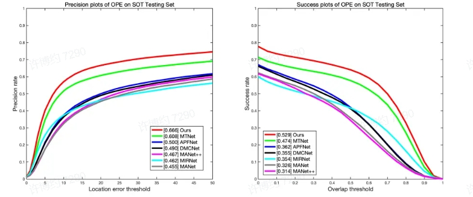
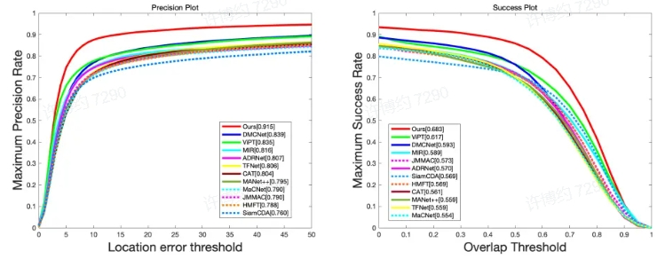

# STIFormer: RGB-T Tracking via Spatial-Temporal Interaction Transformer (TVC under-review))
This is the results of the paper "STIFormer: RGB-T Tracking via Spatial-Temporal Interaction Transformer". The code will be published when the paper is accepted

Existing RGB-Thermal (RGB-T) trackers integrate the RGB and thermal modalities by using cross- attention and estimate the object position by computing the correlation between a single template and the search region. However, many trackers yield unsatisfactory performance due to their disregard for inter-frame cues between modalities and dynamic changes in the dominant modality. To address this issue, we propose a novel Spatial-Temporal Interaction Transformer, called STIFormer, which effectively merges multi-modal features from both spatial and temporal domains, enhancing the robustness of RGB-T tracking. In particular, a spatial-temporal feature representation module is proposed to facilitate inter-frame information exchange
through token propagation, which encodes features from multi-frames and a temporal token. In addition, a token-guided mixed attention fusion module is proposed tofuse the frames feature and token feature from different modalities. Extensive experiments demonstrate that our proposed method achieves state-of-the-art performance on public RGB-T benchmarks.

## 🌟RGBT-234 results
You can download the raw result result.rar

**RGBT234 PR:0.915 SR:0.683**

## 🌟LaSheR results

**LasHeR PR:0.666 SR:0.529**

